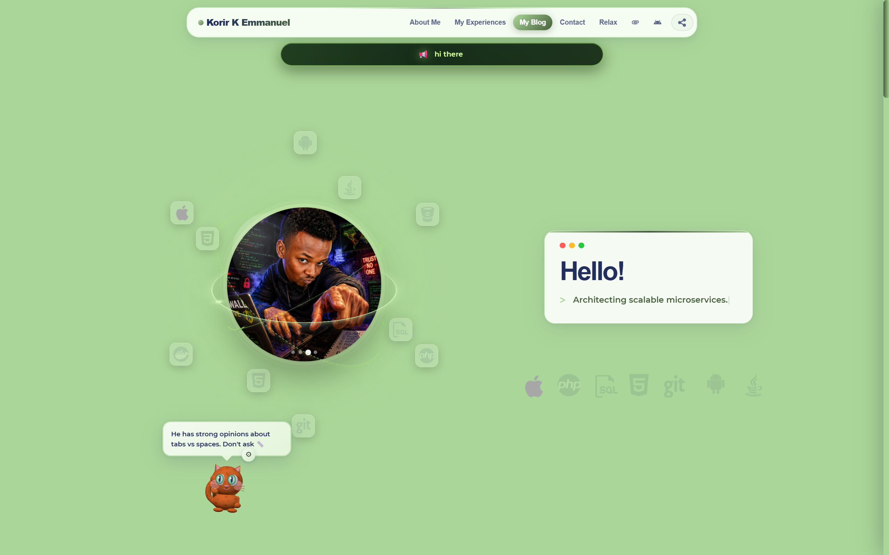
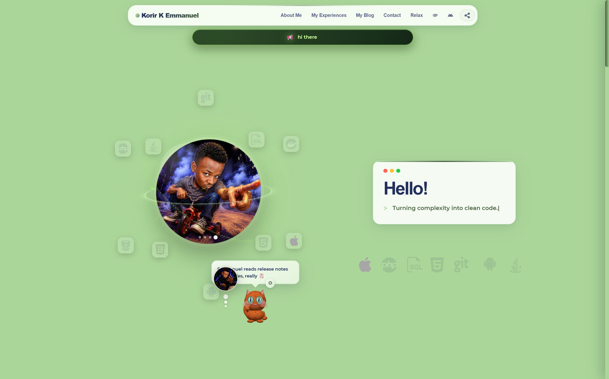
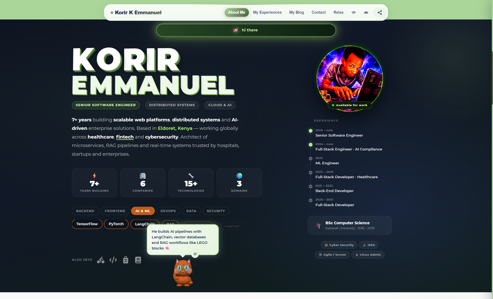
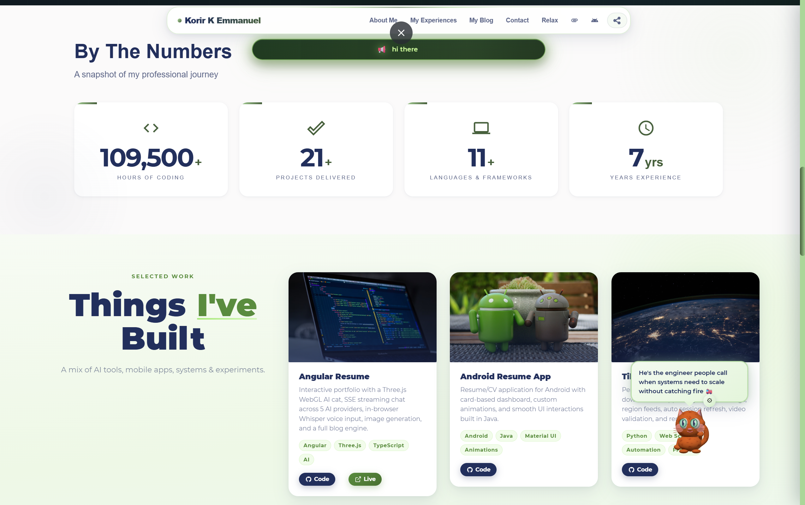
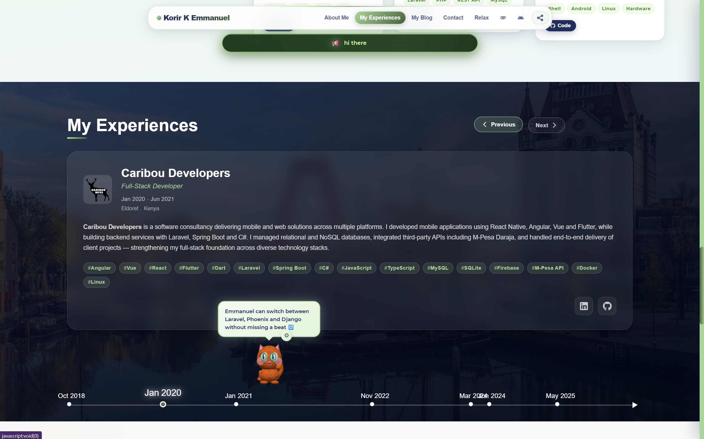
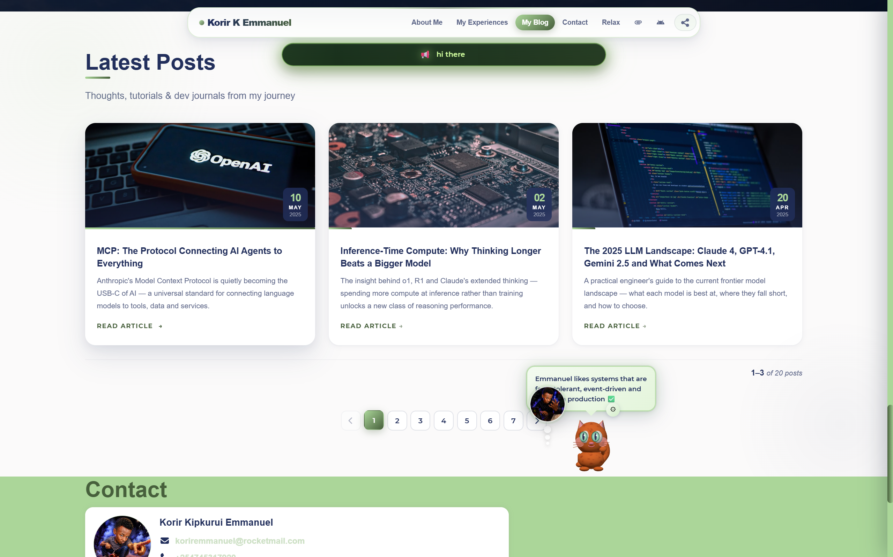

<div align="center">

# Emmanuel Korir &middot; Portfolio

A living portfolio site &mdash; with a 3D AI cat in the corner, a real blog engine, scroll-triggered section animations, and a 404 page you can actually play.

[](https://emmanuel1017.github.io/Angular-Resume/)
[](https://github.com/Emmanuel1017/My-Resume-Flutter-APP/releases/latest/download/portfolio-admin.apk)
[](https://angular.dev)
[](https://threejs.org)

</div>

---

I built this as both a CV and a playground &mdash; somewhere to keep the work, the writing, and a handful of bits I just wanted to make. The whole thing lives on GitHub Pages, gets driven from Firestore so I can flip things on and off from my phone, and ships an Android companion app for the parts that should be native.

## Demo

<p align="center">
  
</p>

<p align="center">
  <a href="https://github.com/Emmanuel1017/Angular-Resume/releases/download/v1.0.0/demo.mp4">Download the full MP4</a>
</p>

---

## Screenshots

<table>
  <tr>
    <td align="center" width="50%"><br/><sub><b>Home</b> &middot; 3D avatar with Kori</sub></td>
    <td align="center" width="50%"><br/><sub><b>Avatar</b> &middot; orbital tech rings</sub></td>
  </tr>
  <tr>
    <td align="center"><br/><sub><b>About</b> &middot; bio &middot; badges &middot; stats</sub></td>
    <td align="center"><br/><sub><b>Things I&rsquo;ve Built</b> &middot; project cards</sub></td>
  </tr>
  <tr>
    <td align="center"><br/><sub><b>Experience</b> &middot; timeline</sub></td>
    <td align="center"><br/><sub><b>Blog</b> &middot; latest posts</sub></td>
  </tr>
</table>

---

## What it actually does

**Kori** is the cat in the bottom-right corner. She's a Three.js rig &mdash; a capsule torso with a procedurally-generated tabby fur texture, a sphere head with painted iris textures, spring-physics ears, and around fifteen named animations (think, speak, lick, purr, swipe, tail-chase, that kind of thing). Behind the rig sits a multi-provider chat client &mdash; OpenRouter by default, but you can flip to OpenAI, Claude, Ollama, or even run a quantised model fully in-browser via Transformers.js. Streaming is plain Fetch + ReadableStream; I had to drop a `setTimeout(0)` after every SSE chunk to keep Angular's zone scheduler from coalescing tokens into one big render frame. Ask her to draw something and she'll route the prompt through Pollinations.ai and animate paw strokes while the image lands.

**Blog engine** &mdash; posts live in a JSON file, the reader opens as a full-screen overlay, and the body scroll gets locked the right way (`position: fixed + top: -${scrollY}px + width: 100%`) so closing the reader doesn't dump the user at the top of the page like every CSS-only `overflow: hidden` trick does. Reading time is calculated at 220 wpm and a progress bar tracks scroll inside the reader.

**Scroll animations** come from [AOS](https://michalsnik.github.io/aos/). One init in `AppComponent` (650ms ease-out-cubic, `once: true`, `refreshHard()` after the async sections paint so their trigger lines land in the right place), then `data-aos="fade-up"` etc. on each section. About, counters, my-work, posts, contact, and the companion-app screenshots all fade in as you scroll past. Experience slides in from the side because the timeline reads left-to-right anyway.

**404 page is a game.** Visit `/404-relax` and you get a fullscreen canvas with cubes that fly at the camera &mdash; tap or swipe to smash them. There's a slow-mo mode after ten smashes, double-strong cubes at 2000 points, and a spinner threshold for variety. The whole thing is around 1500 lines of plain JS in `assets/js/custom.js` &mdash; no game framework. It's a deliberate easter-egg for anyone who hits a dead link.

**Companion app** &mdash; a native Flutter Android build at [Emmanuel1017/My-Resume-Flutter-APP](https://github.com/Emmanuel1017/My-Resume-Flutter-APP). It wraps the site in a WebView with native chrome, but the parts that should be native are native: a Kori chat tab (the WebGL cat gets hidden inside the WebView, replaced with a `CustomPainter` 2D cat I drew in Flutter), a real-time Firestore inbox with FCM push, and admin controls for the Firestore toggles you'll see further down. The web site grew a sticky orange banner and a "Get the App" nav pill that both link to the companion section, both of which auto-hide inside the WebView via a UA marker so the app never advertises itself to itself.

---

## Real-time controls

The site listens to `/portfolio/settings` in Firestore through one shared `onSnapshot` and pushes changes into a `Subject` that every component subscribes to. From the Flutter admin app I can flip these without redeploying:

| Field | Effect |
| --- | --- |
| `available_for_work` | Green badge on the About photo turns on/off |
| `contact_open` | Contact form gets replaced with a dark "I'm not taking messages right now" card with an email CTA |
| `maintenance_mode` | Replaces the entire `<router-outlet>` with a fullscreen overlay. The router stays mounted, so when I turn it back off the scroll position restores |
| `featured_message` | Glass pill banner floats under the navbar across every page. Empty string hides it. |
| `kori_greeting` | Override Kori's opening line on next page load |
| `auto_on` | First Firestore snapshot also sets `available_for_work = true` &mdash; opening the site flips me to available |

Every field has a safe default in `RemoteConfig` defaults, so the site works fine even if the Firestore document is missing.

---

## Tech, in one paragraph

Angular 17 (NgModule hybrid), TypeScript, RxJS, SCSS. Three.js for Kori. Hammer.js for swipe gestures (restricted to horizontal only after `DIRECTION_ALL` was eating vertical scroll on mobile). AOS for scroll-triggered fades. Firebase for Firestore, Remote Config, and the contact-form sink &mdash; via `@angular/fire`. `angular-cli-ghpages` for deploys. `set-env.js` reads `.env` and writes `environment.ts`/`environment.prod.ts` at build time so secrets stay out of git.

---

## Run it locally

```bash
git clone https://github.com/Emmanuel1017/Angular-Resume.git
cd Angular-Resume
npm install
cp .env.example .env       # then fill in the keys below
npm start                  # http://localhost:4200
```

`npm start` runs `set-env.js` first via the `prestart` hook, so you only re-run it manually if you change `.env` without restarting the dev server.

### Keys

The example file lists everything, but the ones that actually have to be set are:

| Variable | What it's for |
| --- | --- |
| `OPENROUTER_API_KEY` | Default Kori provider. Free tier works. [openrouter.ai/keys](https://openrouter.ai/keys) |
| `FIREBASE_API_KEY` &middot; `FIREBASE_PROJECT_ID` &middot; `FIREBASE_AUTH_DOMAIN` &middot; `FIREBASE_MESSAGING_SENDER_ID` &middot; `FIREBASE_APP_ID` | Real-time settings + the contact form. Firebase Console &rarr; Project Settings &rarr; Your apps. |

OpenAI and Anthropic keys are optional &mdash; users can paste their own in Kori's settings panel at runtime anyway.

### Deploy

```bash
npm run deploy
```

Builds with `--base-href=/Angular-Resume/` and pushes to `gh-pages` via `angular-cli-ghpages`. GitHub Pages picks it up in 1-2 minutes. The base-href flag is non-negotiable &mdash; without it the asset URLs resolve from `/` and you'll get a blank page.

---

## Firestore rules

```js
rules_version = '2';
service cloud.firestore {
  match /databases/{database}/documents {
    match /portfolio/settings {
      allow read;
      allow write: if request.auth != null;
    }
    match /contacts/{id} {
      allow create;
      allow read, update, delete: if request.auth != null;
    }
    match /portfolio/meta { allow read, write: if request.auth != null; }
    match /admin_tokens/{token} { allow read, write: if request.auth != null; }
  }
}
```

---

## Layout

```text
src/
|-- app/
|   |-- agent/                Kori - Three.js rig, chat, image gen
|   |-- promo-banner/         Sticky CTA to companion app (hides in WebView)
|   |-- screenshots/          Companion-app phone-mockup carousel (auto-rotates)
|   |-- posts/                Blog grid + full-screen reader
|   |-- 404/                  Canvas cube-smash game
|   |-- welcome/welcome-dp/   3D perspective avatar
|   |-- about, counters,      Resume sections
|   |   experience, my-work, contact
|   |-- header/               Floating navbar with "Get the App" pill
|   `-- core/                 Settings service, directives, pipes
|-- assets/
|   |-- data/                 JSON CMS - about, posts, projects, experience
|   |-- screenshots-app/      Companion-app screenshots for the carousel
|   |-- js/custom.js          404 game implementation
|   `-- kori-facts.json       Random fact bubbles
|-- environments/
|   |-- environment.example.ts   committed
|   |-- environment.ts            gitignored, generated
|   `-- environment.prod.ts       gitignored, generated
`-- scripts/set-env.js        Reads .env -> writes environment files
```

---

## The companion app

Built it because the things I actually want on my phone aren't "view the portfolio" &mdash; they're "ping me when someone messages me" and "flip availability without opening a laptop." So the Flutter app does both, plus runs a native Kori (no WebGL on the phone), plus has a paginated Firestore inbox.

Source &mdash; [Emmanuel1017/My-Resume-Flutter-APP](https://github.com/Emmanuel1017/My-Resume-Flutter-APP)
Download &mdash; [v1.0.0 APK](https://github.com/Emmanuel1017/My-Resume-Flutter-APP/releases/latest/download/portfolio-admin.apk)

Both projects share one Firebase project. The Flutter README has the full setup &mdash; including the Cloud Function that fans out FCM pushes to admin devices when a new contact lands.

---

Emmanuel Korir &middot; Senior Software Engineer &middot; Eldoret, Kenya &middot; [github.com/Emmanuel1017](https://github.com/Emmanuel1017)
